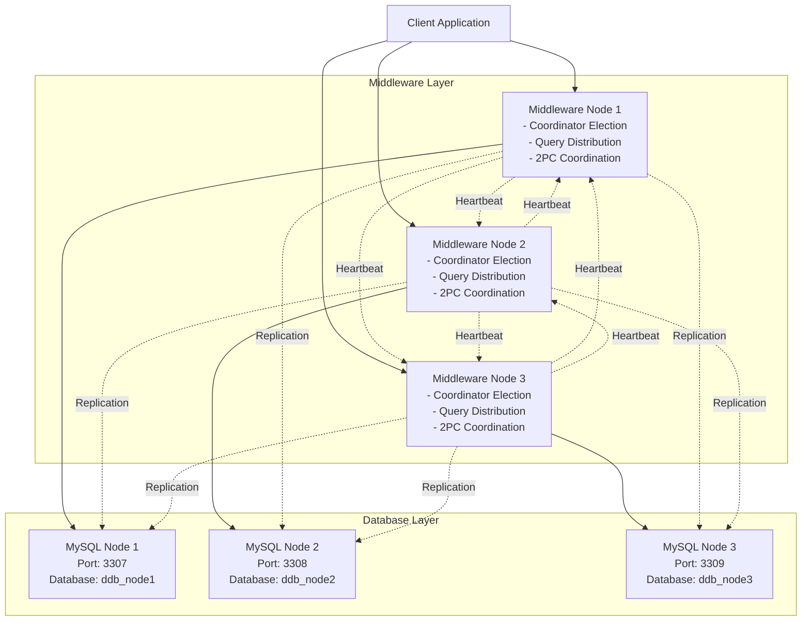

# Distributed Database Middleware

A distributed database system with custom replication, 2-phase commit, and coordinator election using the Bully algorithm.

## Overview

This project implements a distributed database middleware system that manages three MySQL nodes with:
- **Custom replication logic** (not MySQL's built-in replication)
- **Socket-based communication** between nodes
- **ACID properties** ensured through 2-phase commit protocol
- **Coordinator election** using the Bully algorithm
- **Heartbeat monitoring** for failure detection
- **Load balancing** for read query distribution

## Architecture



### Key Components

1. **Communication Layer**: Socket-based messaging with checksums
2. **Database Layer**: MySQL connection pooling and query execution
3. **Transaction Management**: Lock manager and 2-phase commit
4. **Monitoring**: Heartbeat, health checking, and load balancing
5. **Core**: Bully election and coordinator logic

## Prerequisites

- Docker (version 20.10+)
- Docker Compose (version 1.29+)
- Python 3.11+ (for local development)

## Quick Start

### 1. Clone and Setup

```bash
cd ddb-middleware
```

### 2. Start the System

```bash
# Build and start all containers
docker-compose up --build

# Or run in detached mode
docker-compose up -d --build
```

This will start:
- 3 MySQL containers (ports 3307, 3308, 3309)
- 3 Middleware nodes (ports 5001, 5002, 5003)


