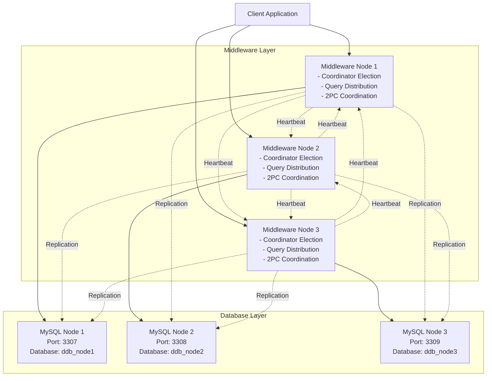

# Distributed Database Middleware

A distributed database system with custom replication, 2-phase commit, and coordinator election using the Bully algorithm.

## Overview

This project implements a distributed database middleware system that manages three MySQL nodes with:
- **Custom replication logic** (not MySQL's built-in replication)
- **Socket-based communication** between nodes
- **ACID properties** ensured through 2-phase commit protocol
- **Coordinator election** using the Bully algorithm
- **Heartbeat monitoring** for failure detection
- **Load balancing** for read query distribution

## Architecture



### Key Components

1. **Communication Layer**: Socket-based messaging with checksums
2. **Database Layer**: MySQL connection pooling and query execution
3. **Transaction Management**: Lock manager and 2-phase commit
4. **Monitoring**: Heartbeat, health checking, and load balancing
5. **Core**: Bully election and coordinator logic

## Prerequisites

- Docker (version 20.10+)
- Docker Compose (version 1.29+)
- Python 3.11+ (for local development)

## Quick Start

### 1. Clone and Setup

```bash
cd ddb-middleware
```

### 2. Configure Environment

The `.env` file contains database credentials:

```env
MYSQL_ROOT_PASSWORD=root_password_123
MYSQL_USER=ddb_user
MYSQL_PASSWORD=ddb_password
```

### 3. Start the System

```bash
# Build and start all containers
docker-compose up --build

# Or run in detached mode
docker-compose up -d --build
```

This will start:
- 3 MySQL containers (ports 3307, 3308, 3309)
- 3 Middleware nodes (ports 5001, 5002, 5003)

### 4. Verify System is Running

```bash
# Check container status
docker-compose ps

# Check logs
docker-compose logs middleware-node1
docker-compose logs middleware-node2
docker-compose logs middleware-node3
```

## Using the CLI Client

### Interactive Mode

```bash
# Connect to any middleware node 
python client/cli_client.py --host localhost --port 5001
```

Example session:

```
ddb> SELECT * FROM users;
Query successful
Node: 2
Transaction ID: TXN-1704123456789-abc123ef
Results (3 rows):
================================================================================
id              | name            | email           | created_at
--------------------------------------------------------------------------------
1               | Alice Johnson   | alice@example.com | 2024-01-01 10:00:00
2               | Bob Smith       | bob@example.com   | 2024-01-01 10:00:00
3               | Carol Williams  | carol@example.com | 2024-01-01 10:00:00
================================================================================

ddb> INSERT INTO users (name, email) VALUES ('David Brown', 'david@example.com');
Query successful
Affected rows: 1

ddb> EXIT
Goodbye!
```

### Single Query Mode

```bash
python client/cli_client.py --host localhost --port 5001 --query "SELECT * FROM users"
```

## System Operations

### Testing Replication

Write queries are automatically replicated to all nodes:

```sql
INSERT INTO users (name, email) VALUES ('Test User', 'test@example.com');
```

Verify replication by connecting to each MySQL node:

```bash
# Node 1
mysql -h 127.0.0.1 -P 3307 -u ddb_user -p ddb_node1 -e "SELECT * FROM users;"

# Node 2
mysql -h 127.0.0.1 -P 3308 -u ddb_user -p ddb_node2 -e "SELECT * FROM users;"

# Node 3
mysql -h 127.0.0.1 -P 3309 -u ddb_user -p ddb_node3 -e "SELECT * FROM users;"
```

### Testing Coordinator Election

Simulate coordinator failure:

```bash
# Stop the current coordinator (assume node 3 is coordinator)
docker stop middleware-node3

# Check logs to see election
docker-compose logs middleware-node1
docker-compose logs middleware-node2

# You should see election messages and new coordinator announcement
```

Restart the failed node:

```bash
docker start middleware-node3
```

### Testing Load Balancing

Read queries are distributed across nodes using round-robin:

```bash
# Run multiple SELECT queries
for i in {1..10}; do
  python client/cli_client.py --port 5001 --query "SELECT * FROM users"
done

# Check logs to see which nodes handled queries
docker-compose logs | grep "Handling read query"
```

### Viewing Transaction Logs

Each node maintains a transaction log:

```sql
SELECT * FROM transactions_log ORDER BY created_at DESC LIMIT 10;
```

## Development

### Local Development Setup

```bash
# Create virtual environment
python -m venv venv
source venv/bin/activate  # On Windows: venv\Scripts\activate

# Install dependencies
pip install -r requirements.txt

# Run a single node locally (requires MySQL running)
python main.py --node-id 1
```

### Running Tests

```bash
# Install pytest
pip install pytest

# Run all tests
pytest tests/

# Run specific test file
pytest tests/test_communication.py

# Run with verbose output
pytest -v tests/
```

### Project Structure

```
ddb-middleware/
├── client/
│   └── cli_client.py          # CLI client for database interaction
├── config/
│   ├── database.json          # Database configuration
│   └── nodes.json             # Node topology configuration
├── docker/
│   ├── middleware/
│   │   └── Dockerfile         # Middleware container image
│   └── mysql/
│       ├── node1/init.sql     # MySQL initialization scripts
│       ├── node2/init.sql
│       └── node3/init.sql
├── src/
│   ├── communication/         # Socket messaging layer
│   ├── core/                  # Election and coordinator
│   ├── database/              # MySQL connection and queries
│   ├── monitoring/            # Heartbeat and health checks
│   ├── security/              # Checksums
│   ├── transaction/           # 2PC and lock management
│   └── utils/                 # Config and logging
├── tests/                     # Unit tests
├── main.py                    # Node entry point
├── docker-compose.yml         # Container orchestration
└── requirements.txt           # Python dependencies
```

## System Flows

### Write Query Flow

1. Client sends query to any middleware node
2. Node forwards to coordinator (if not coordinator itself)
3. Coordinator initiates 2-Phase Commit:
   - **Phase 1 (Prepare)**: Ask all nodes if they can commit
   - All nodes validate and vote YES/NO
   - **Phase 2 (Commit/Abort)**: If all YES, commit; otherwise abort
4. All nodes execute the write
5. Result returned to client

### Read Query Flow

1. Client sends query to any middleware node
2. Node forwards to coordinator
3. Coordinator uses load balancer to select a node
4. Selected node executes query
5. Result returned to client

### Coordinator Election Flow

1. Heartbeat monitor detects coordinator failure
2. Health checker triggers election
3. Node starts Bully election:
   - Sends ELECTION message to higher ID nodes
   - If no response, becomes coordinator
   - If response received, waits for announcement
4. New coordinator announces itself to all nodes

## Configuration

### Node Configuration (`config/nodes.json`)

```json
{
  "nodes": [
    {
      "id": 1,
      "ip": "middleware-node1",
      "port": 5001,
      "mysql_host": "mysql-node1",
      "mysql_port": 3306,
      "mysql_database": "ddb_node1"
    }
  ],
  "heartbeat_interval": 5,
  "heartbeat_timeout": 15
}
```

### Database Configuration (`config/database.json`)

```json
{
  "user": "ddb_user",
  "password": "ddb_password",
  "charset": "utf8mb4",
  "autocommit": false
}
```

## Troubleshooting

### Containers Won't Start

```bash
# Check for port conflicts
lsof -i :5001
lsof -i :3307

# Remove old containers and volumes
docker-compose down -v
docker-compose up --build
```

### Connection Refused

```bash
# Ensure all containers are running
docker-compose ps

# Check container logs
docker-compose logs mysql-node1

# Verify network connectivity
docker network inspect ddb-middleware_ddb-network
```

### Replication Not Working

```bash
# Check middleware logs for errors
docker-compose logs middleware-node1 | grep ERROR

# Verify all nodes can communicate
docker exec middleware-node1 ping middleware-node2
docker exec middleware-node1 ping middleware-node3
```

### Election Not Triggering

```bash
# Check heartbeat configuration
cat config/nodes.json | grep heartbeat

# View heartbeat logs
docker-compose logs | grep -i heartbeat
```

## Advanced Topics

### Adding More Nodes

1. Update `config/nodes.json` with new node configuration
2. Add MySQL and middleware services to `docker-compose.yml`
3. Create MySQL init script in `docker/mysql/nodeN/`
4. Rebuild and restart: `docker-compose up --build`

### Changing Load Balancing Strategy

Edit node initialization in `src/core/node.py`:

```python
self.load_balancer = LoadBalancer(
    node_id=self.node_id,
    strategy="least_loaded"  # or "round_robin"
)
```

### Monitoring System Health

```bash
# View real-time logs
docker-compose logs -f

# Check resource usage
docker stats

# View node-specific logs
tail -f logs/node_1.log
```

## Performance Considerations

- **Connection Pooling**: Each node maintains a MySQL connection pool (default: 5 connections)
- **Heartbeat Interval**: Default 5 seconds (configurable in `nodes.json`)
- **Lock Timeout**: Default 30 seconds for acquiring locks
- **2PC Timeout**: Default 30 seconds for transaction coordination

## Security Notes

- Change default passwords in `.env` for production
- Use TLS for socket communication in production
- Implement authentication for client connections
- Restrict network access to middleware ports

## License

This is an educational project for distributed systems learning.

## Contributors

Built as part of distributed systems laboratory coursework.
